<div align="center">

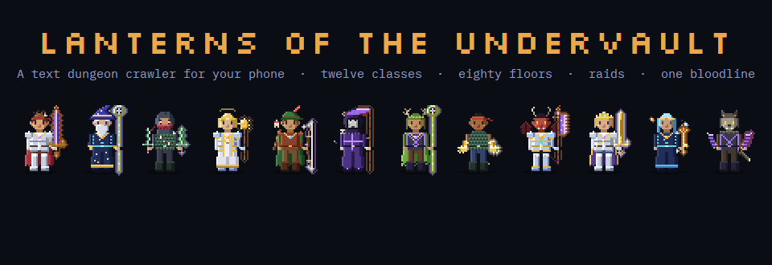

**A text dungeon crawler in the old MUD style, built for your phone.**<br>
Fight, loot, tame beasts and descend beneath Emberfall to relight the failing seals.

[](https://playundervault.com/)
[](https://github.com/A-Theme/undervault/releases/latest)
[](https://github.com/A-Theme/undervault/releases/latest)
[](LICENSE)

</div>

<table>
<tr>
<td width="310" valign="top">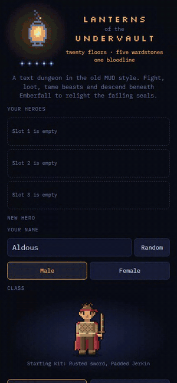</td>
<td valign="top">

### Type like it's 1995. Tap like it's now.

Every room is written prose. Every command is a word you type, or a button you tap. Tap any highlighted word in the text to act on it.

- **A story in four books**: five chapters down to the Ember Throne, then **Book II: The Hunger Below**, five more acts beneath it, then **Book III**: the crossing to **Solenne**, a far kingdom, and five acts down the **Drowned Stair** beneath it, then **Book IV: The Lantern War**, five acts at war with the iron king of Kaldmark, and a garden at the top of the world where **Lily the Sweethang** keeps the stolen summers
- **80 seeded floors**, 20 story bosses, the crossing to Solenne, **11 side dungeons** with four **difficulty tiers** up to Nightmare, an endless **Abyss**, random **champions**, and **Winston the Wanderer**, who turns up when you least expect him
- A **Lore Book** with every chapter you have reached and a portrait of everyone in it
- **12 classes**, 60 skills, talents, and **titles** that grow from Squire to God-Slayer
- **Loot you can see**: every weapon and suit of armor shows up on your pixel-art hero; rare **legendaries** and class **sets**
- **Chests** from rusty to legendary, each with its own opening
- **24 pets** to buy, hatch or tame, and they evolve
- **Animated cutscenes**, boss reveals, about **55 sound effects** and **ambient music**
- A **mini-map** that follows you, and an **Expeditions** screen for picking where to go
- **Sign in with Google or Discord** to keep your heroes, friends and name on every device (cloud saves)
- **Play with friends**: add friends by code, see who is online, send them your seed to race or play live together, or invite them to a **raid** as a party of four
- An online **leaderboard** for the Abyss, a **daily dungeon**, **Hardcore mode**
- Installs on your phone and **plays offline**

<br>

**[▶ Play now](https://playundervault.com/)** &nbsp;·&nbsp; [Watch the teaser](media/teaser.mp4) &nbsp;·&nbsp; [Read the lore](LORE.md) &nbsp;·&nbsp; [What's new](https://github.com/A-Theme/undervault/releases)

</td>
</tr>
</table>

## Play

**Book I is free:** the whole first story, floors 1 to 20, seven side dungeons and the endless Abyss. Books II to IV, their dungeons and the raids are the **full game**: CA$6.99 (about US$5) on the website unlocks it everywhere, every browser and the Android app; or buy it inside the Android app for that app alone. The store isn't open yet. Everyone who plays before it opens becomes a **Founder** and keeps the full game.

| Where | How |
|---|---|
| **Any browser** | Open **https://playundervault.com/**. Your save stays on your device. |
| **iPhone / iPad** | Open the link in Safari, then **Share → Add to Home Screen**. It runs full-screen and offline. |
| **Android** | Open the link in Chrome, then **Install app**. Or download **[undervault.apk](https://github.com/A-Theme/undervault/releases/latest/download/undervault.apk)** and open it on your phone. |
| **Steam Deck** | One command in Desktop Mode puts it in your Steam library, controller and all. See [Steam Deck](#steam-deck) below. |

Keep up to **three heroes** and switch between them from the title screen (or **Menu → Heroes**). Use **Menu → Export save** to back up a hero or move it to another device: you get a short code to paste into **Import save** there.

### Steam Deck

1. Press the **Steam** button, then **Power → Switch to Desktop**.
2. Open the app menu at the bottom left, then **System → Konsole**.
3. Paste this and press Enter (**Steam + X** brings up the keyboard):

   ```bash
   curl -fsSL https://playundervault.com/steamdeck.sh | bash
   ```

4. When it says **Done**, double-click **Return to Gaming Mode** on the desktop.
5. In your Library, open the **Non-Steam** tab and start **Lanterns of the Undervault**.

The command makes a *Lanterns of the Undervault* app that opens the game full-screen, with its icon, and adds it to your Steam library. It uses Chrome, Chromium, Edge, Brave or Firefox if you have one, and otherwise installs Chromium from Flathub for your user only (no sudo).

- **Controller**: the game plays with the Deck's controls (and any Xbox, PlayStation or Switch Pro controller in a browser). If the buttons do nothing, open the game's controller settings in Steam and pick the **Gamepad** layout.
- **Artwork**: the installer saves Steam library art to `~/.local/share/undervault/art`. On the game's page, choose Properties > Customization (or Manage > Set custom artwork) to use it.
- Run the command again to update the launcher, or add `-s -- --uninstall` after `bash` to remove it.

### Playing with a controller

| | |
|---|---|
| **Walk** | D-pad or left stick (in a fight, left and right pick the action) |
| **Act** | **A** presses the glowing action above the pads; **LB / RB** pick another |
| **Stairs** | **LT** up, **RT** down |
| **Map, pack, menu** | **Y**, **View**, **Menu** |
| **Pointer** | **X**, then the stick reaches any button or word on screen and **A** presses it |
| **Back** | **B** closes menus and the map and moves cutscenes on |
| **Scroll** | right stick |

On the title screen and in every menu, the stick moves between buttons, **A** presses and **B** goes back. Big hits rumble.

## Twelve classes

<p align="center">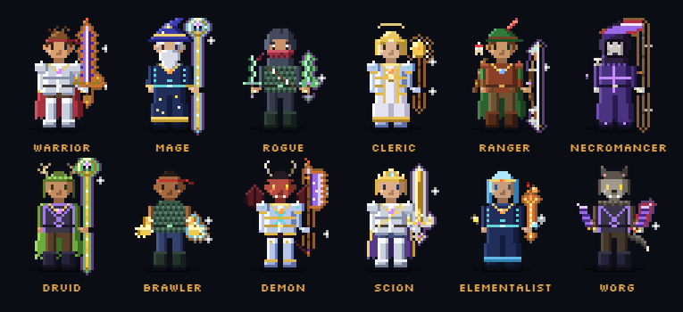</p>

<p align="center"></p>

Every class comes as a male or a female hero: pick on the title screen. Each class also has its own voice: why your hero answered Maren's call, how she greets you, your own moves in a fight, a line for every big kill, how you fall, and how your story is remembered.

| Class | Plays like | Weapons | Armor | Skills |
|---|---|---|---|---|
| **Warrior** | Steel and stubbornness. Most health, crushing melee, stuns. | sword · axe · mace | heavy | Shield Bash, Cleave, War Cry, Whirlwind, Last Stand |
| **Mage** | Fire, frost and time. Fragile, but hits like a falling star. | staff · wand | cloth | Firebolt, Frost Lance, Arcane Shield, Meteor, Time Warp |
| **Rogue** | Crits, poison and vanishing tricks. Strikes first. | dagger · sword · bow | light | Backstab, Poison Blade, Smoke Bomb, Shadowstep, Death Mark |
| **Cleric** | Lantern-light made fist. Heals, wards and smites. | mace · staff | heavy | Smite, Mend, Lantern Ward, Purge, Divine Wrath |
| **Ranger** | Starts with a wolf. Best tamer; empowers pets. | bow · dagger · axe | light | Aimed Shot, Beast Bond, Volley, Snare, Call of the Wild |
| **Necromancer** | Drains life, raises skeletons, curses the living. | scythe · wand · staff | cloth | Drain Life, Bone Spear, Raise Dead, Withering Curse, Soul Harvest |
| **Druid** | Thorns, healing, and a bear's hide when it counts. | staff · scythe | light | Thornlash, Rejuvenate, Bear Form, Entangle, Wrath of the Grove |
| **Brawler** | Fists and footwork. Hits fast and keeps hitting. | fists · mace | light | One-Two, Uppercut, Second Wind, Haymaker, Hundred Fists |
| **Demon** | Half-born of the Hunger. Burns and drains. | axe · scythe · sword | heavy | Hellfire, Soul Rend, Infernal Hide, Brimstone, Unleashed |
| **Scion** | Heir of the Order. Blade, ward and judgement. | sword · mace | heavy | Crown's Edge, Aegis, Rally, Judgement, Ascendance |
| **Elementalist** | Fire, frost and storm. Fragile, always has an answer. | wand · staff | cloth | Flame Lash, Ice Shard, Stoneskin, Chain Lightning, Elemental Storm |
| **Worg** | A wolf in a person's skin. Rends, howls, heals on the hunt. | claws · axe | light | Rend, Howl, Pounce, Feral Frenzy, Blood Moon |

As you level, your hero earns titles: a warrior starts as *the Squire* and climbs through *the Champion* and *the Legendary Warrior* to *the Titan* and, at level 70, *the God-Slayer*. Every class has its own fifteen. Deeds earn rarer ones (*Keeper of the Five*, *the Oathkeeper*, *the Hunger-Slayer*), and so does rare gear: epics and legendaries carry titles, the deepest tiers' rarer still, the Underside's relics their own, and a whole class set its set's title. Type `title` to choose which you wear.

## Gear you can see

Your hero is a pixel-art paper doll drawn from what you're actually wearing. Each class has its own weapons and armor family (heavy, light or cloth). Gear from another class still works, but 30% weaker. Seven tiers of armor change your silhouette. Ten weapon types each have four designs that improve with their material.

Legendaries are rare, and worth it. Hardly any drop by chance: they come from quests, first clears and the six **Trials of Legend** (type `trials`). A legendary hits about twice as hard as anything else of its tier and carries a power (lightning strikes, executing the wounded, blocking blows, cheating death). Some legendaries are pieces of a **class set** (weapon, armor, amulet and ring) with bonuses for wearing two and all four. Rarity adds glows and sparkles, and enchantments wreathe your weapon in flame, frost, venom or blood. Tap **preview** on anything in your pack to see yourself wearing it, plus every stat it changes, before you commit.

<p align="center">
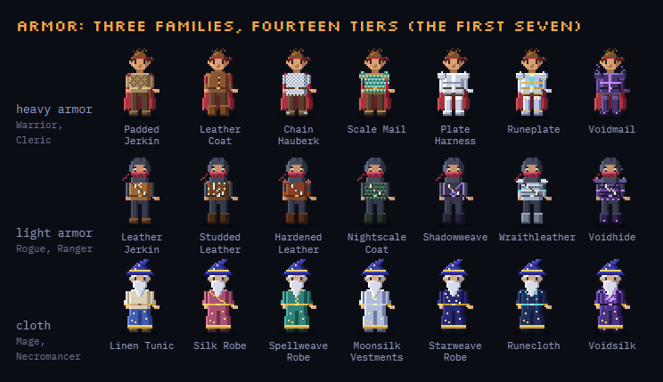<br>
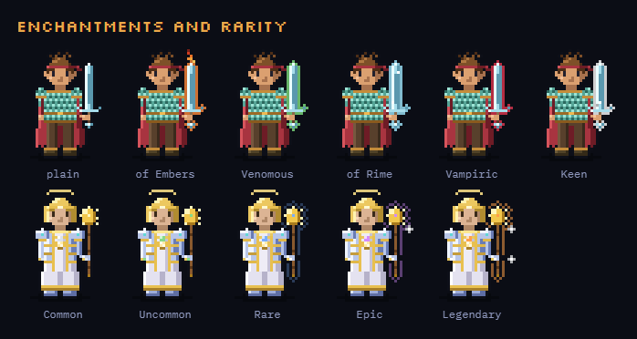
</p>

<details>
<summary><b>All 40 weapon designs</b></summary>
<p align="center">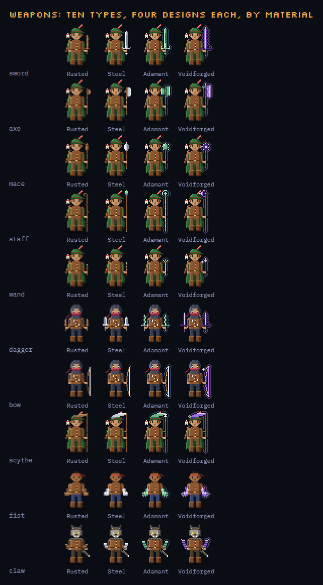</p>
</details>

## Chests

Chests are described as what they are, and the better ones turn up deeper: rusty, iron, gold, epic, and the rare legendary coffer. Opening one plays its own little scene; some of them are mimics.

<p align="center">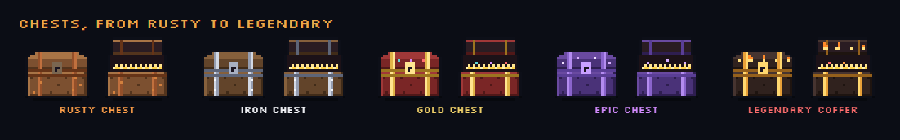</p>

## Bosses and beasts

Fifteen story bosses, across three books, guard the way down, and every side dungeon, the crossing, the Underside and the Abyss has its own. Here are the first nine. Each one gets a reveal when you find it. Every pet you buy, hatch or tame has its own sprite, and it changes when the pet evolves.

<p align="center">
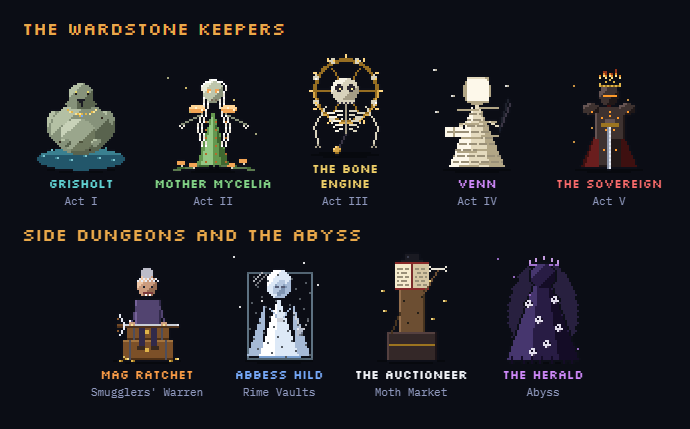<br>
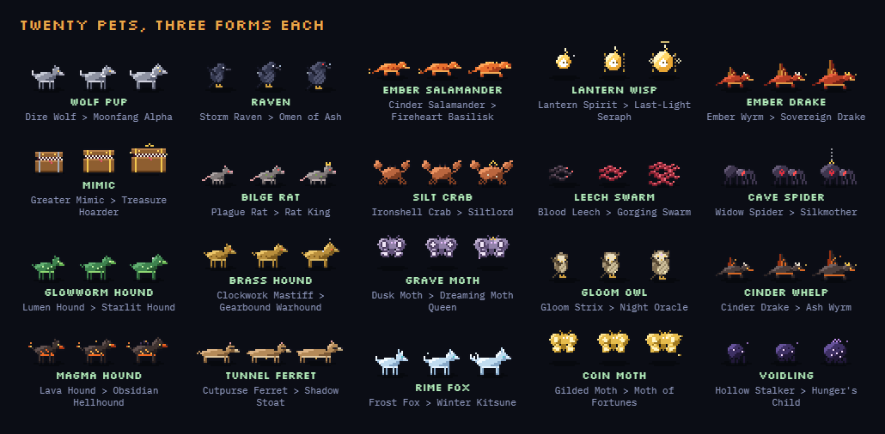
</p>

## Screenshots

<p align="center">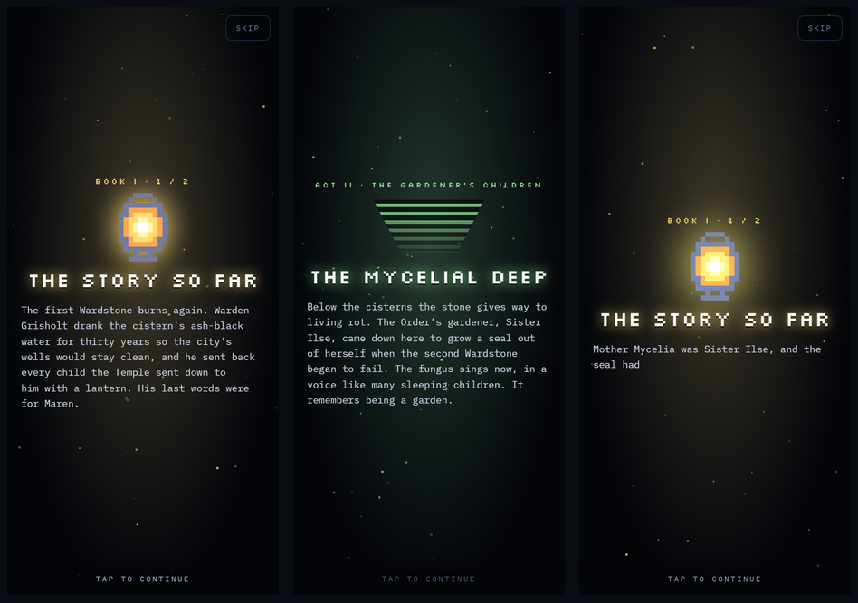</p>

<p align="center">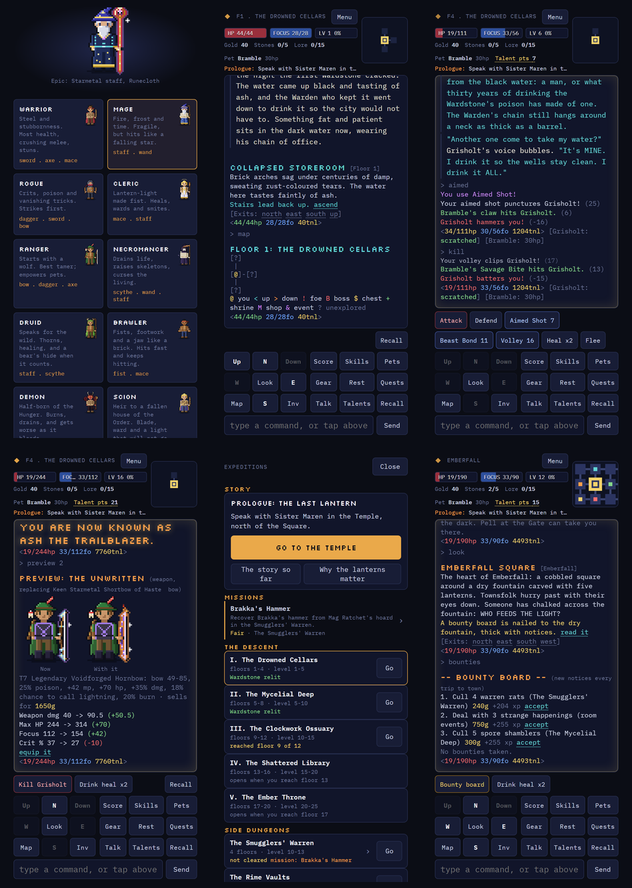</p>

## The world

> *Emberfall was built on a lid.*

Three hundred years ago the Lantern Order chained the **Ashen Sovereign** beneath the city. Five **Wardstones** hold the seal, one beneath another. Tonight the Last Lantern above the Temple guttered and turned blue, and Sister Maren sent for anyone who can hold a weapon. You answered. It felt like being called by name.

Descend through the **Drowned Cellars**, the **Mycelial Deep**, the **Clockwork Ossuary**, the **Shattered Library** and the **Ember Throne**: five chapters, each with its own story to follow. The goal under the status bar always says what to do next. Rescue a boy from the cellars, find out who has been chalking the fountain, and learn what the Order has been feeding the seal. The townsfolk have missions of their own once the Wardstones burn again. Find all fifteen lore scrolls and choose how it ends.

Then the story goes on. Beneath the Throne, where the histories end, a stair goes down into **the Hunger Below**: the Unlit Stair, the Hall of the Fed where the Order's lost orphans still wait, the Archive of Ash, Arden's Watch, and the Heart of the Hunger itself. What Maren tells you when you set out depends on how you ended Book I.

**[Read the full lore guide →](LORE.md)** (the spoilers are folded away)

## What's inside

<details>
<summary><b>Dungeons</b></summary>

- 80 big floors across 20 acts in four books, each act with its own hand-written rooms, monsters, story encounters and music. Every floor is built from your **seed**: share it, and a friend gets the exact same dungeon.
- Monsters level up to meet you, and the later acts are a real fight: come under-levelled or under-geared and they will kill you.
- 20 story bosses with move patterns, telegraphed heavy attacks (hit **Defend**!), second phases, helpers they call in, and a last enrage.
- Random **champions**: named mini-bosses that turn up on deeper floors and always drop something good.
- 11 side dungeons that open as the story goes on and grow deeper every time you clear them: the **Smugglers' Warren**, the **Rime Vaults**, the **Moth Market**, the **Sunken Orchard**, the **Bellfounder's Undercroft**, the **Ink Wells**, the **Nursery of Small Beds**, the **Unwritten Stacks**, the **Watch-Wall**, and in Solenne the **Glass Catacombs** and the **Salt Mines**. Each has its own boss, a unique item and a pet egg, some have their own shape of floor (caves, mazes, towers, long galleries), and you can replay them.
- **Difficulty tiers**: run any side dungeon at **Normal, Veteran, Heroic or Nightmare**. Each tier opens when you clear the one before, is much harder, and pays much better, up to a legendary for a first Nightmare clear.
- **Missions** from the people of Emberfall and Solenne, with lasting rewards, then harder requests for every dungeon at every tier.
- Room events: blood altars, a gambling imp, wishing wells, duelists who name stakes, traps, lost children to send home, and challenges: **pick a lock** in rhythm, **trace glyphs** in order, **run** from a falling ceiling, answer a **stone face's riddle**, solve an **Order mechanism's** puzzle.
- **Thieves** lunge for your pack. Catch them, or hunt them down on the floor to get your things back.
- **The crossing** (Book III): a voyage across the Ashen Sea or a long walk by the North Road, each leg a dungeon with a charted lane through it. Stay on it and you mostly live; leave it for storms, fog, pirates, bandits, far tougher monsters, wrecks, caches and shortcuts. Supplies run down with every step, and a rift can drag you into **the Underside**.
- **Solenne**, a second city across the sea, with its own Queen, smiths, inn and gate home, and below it **the Drowned Stair**: five more acts, floors 41 to 60, down to the Hunger's second door.
- **The Lantern War** (Book IV): floors 61 to 80 are battlefields, from the sappers' tunnels under Emberfall to the iron king's fortress. You march with a squad that fights beside you, Sister Hollis patches you up at every floor's stairs, and every floor has objectives to take: hold the line, break a siege engine, free the captives, take the banner.
- **Winston the Wanderer**: a boy of about seven who is three hundred years old, in a coat of a hundred patches. He turns up in quiet rooms with a title that tells you what he is about to do: a tale, a trade, a gift, an errand, a wager, a wrong door, a piece of his own story, or, very rarely, a legendary that exists nowhere else.
- **Emberfall** has fourteen places, the North Gate and the Harbour Light among them, and a cemetery, a fortune teller, a jeweler, an alchemist, the watch captain's contracts and the old docks, besides the forge, the Temple, the menagerie and the inn.

</details>

<details>
<summary><b>Progression</b></summary>

- Levels come slowly, and each one counts: stats and talent points (1.4 a level) grow fast. The cap is 80.
- Talents: 14 general talents and 4 per class (a deeper one at level 25 and a capstone at 40). Ranks cost more as they climb (1, 1, 2, 2, 3), so you choose. Sister Maren resets them for a fee.
- 14 material tiers that keep pace with the monsters to the end of Book IV (Lanternforged in Book II, then Ashglass, Tideforged, Dawnforged and Doorwrought, then the war's Rimesteel and Sunforged), 5 rarities, enchantments, legendaries and one-of-a-kind uniques.
- Weapons come in sub-kinds: a sword can be a sabre, falchion or greatsword, a mace a flail or warhammer. That is over a thousand weapon designs before rarity and enchantments, and gear sometimes carries the name of where it was made.
- Two class sets for every class (one from the first books, one from the war), each with its own title.
- Five gear slots: weapon, armor, amulet and two rings.
- Brakka's forge upgrades gear to +5 and reforges enchantments. Tobble trains your pets. A stash at the inn holds what you can't carry.
- A bounty board in the Square with rotating jobs.

</details>

<details>
<summary><b>Pets</b></summary>

- 20 species to buy, hatch from eggs or tame (beat a beast below a third of its health, then `tame` it).
- Pets fight beside you with their own abilities: bites, blinds, burns, heals, shields, stuns and more.
- Every pet evolves at levels 10 and 20. Your Wolf Pup becomes a Dire Wolf, then a Moonfang Alpha.
- **Pets can die.** One that goes down has until you leave the floor: a Pet Treat, a rest, a shrine or a well brings it back. Leave it, or let a monster finish it, and it is gone for good.

</details>

<details>
<summary><b>Modes</b></summary>

- **Hardcore**: one life. If you fall, the save is gone. In return: +20% XP and gold, and better loot.
- **Daily dungeon**: tap *Today* on the title screen and everyone plays the same dungeon that day.
- **New Game+**: keep your hero; the dark gets deadlier.
- The story is told as it happens: short slideshows when a chapter starts, when a boss falls and when you reach a new city, with what has happened and what comes next, and why the lanterns matter. `recap` replays them.
- Each book ends with a choice: three endings for Book I, two for Book II, two for Book III and three for Book IV, one of each hidden behind that book's fifteen lore scrolls.
- **Trials of Legend** for every book: eighteen feats, each with a legendary for certain.

</details>

<details>
<summary><b>Made for phones</b></summary>

- Context buttons that change with what you're doing, optional touch pads, and tappable words in the story text.
- A pixel **mini-map** in the corner that follows you; tap it for the whole floor.
- An **Expeditions** screen (tap the goal line) for the story, your missions, every act and side dungeon, raids and bounties. Tap a mission for its own screen: its story, where it is, how hard it is for your level, the reward, **Start**, and **Invite a friend**.
- About 55 sound effects, ambient music for the village, every act, bosses and raids, vibration and cutscenes, each with a toggle in the menu.
- Installs to your home screen and plays offline. Native Android and iOS app projects are included.
- Command chaining (`n;e;kill`), speedwalking (`.3n2e`) and aliases for veterans.

</details>

## Play together

Every dungeon is built from its seed, so a friend on the same seed gets the same floors, rooms and monsters.

- **Share a seed.** Tap *Share this seed with a friend* on the title screen, or type `share` in the game (also **Menu → Share seed**). Your friend opens the link and the seed is already filled in.
- **Race.** `race` shows everyone who has played your seed: how deep they got, how many Wardstones they relit, how often they died and who finished. The daily dungeon is one big race.
- **Play live.** Tick *Play live* when you start, or type `live on`.
  - Friends live on the same seed show up on your map as a magenta `@`, and in any room you share.
  - Their big moments (a boss down, a death, a legendary find) appear in your log.
  - Talk with `say`.
  - You each have your own monsters and loot. Monsters get tougher (and pay more) when friends are on your floor, and friends in the same room fight beside you.

### Raids

Four raids, each a short dungeon with a mega boss and a long story of its own (the hardest is **Lily's Everlasting Summer**, which opens once you have faced Lily in Book IV), for a party of 2 to 4 friends playing at the same time (built for four). One of you forms a party from the Expeditions screen and shares its five-letter code; when everyone is in, the leader starts. The boss's health is shared by the whole party, but its blows land on each of you, so a smaller party takes a beating. Defend against its cataclysms, deal with its helpers, and finish it before it loses patience. Everyone who hurt it gets their own loot, and clearing a raid earns a title.

## The Abyss and the leaderboard

Beat the Sovereign and the Gate opens onto **the Abyss**: endless floors where the monsters keep getting stronger and a **Herald of the Hunger** waits every fifth floor. Your deepest floor goes to an online leaderboard. The current top three are on the title screen; the top twenty are under **Menu → Leaderboard**.

<details>
<summary><b>How to play: the commands</b></summary>

| | |
|---|---|
| Move | `n` `e` `s` `w` `u` `d`, or the pad. Chain with `;`, speedwalk with `.3n2e` |
| Look | `look`, `look <thing>`, `map`, `where` |
| Fight | `kill <foe>`, `defend`, `flee`, `tame`, or type a skill's name |
| Gear | `inv`, `eq`, `equip <#>`, `preview <#>`, `remove <slot>`, `use <#>`, `get all`, `drop <#>` |
| Crossing | `descend` (the Drowned Stair in Solenne), `sail`, `walk`, `gate`, `provision <n>`, `supplies`; on the way `hail`, `salvage`, `explore`, `follow`, `pay`, `enter` |
| Town | `talk`, `list`, `buy <#>`, `sell <#>`, `sell junk`, `upgrade`, `reforge`, `train`, `stash`, `bounties`, `fortune`, `polish <charm>`, `contract` |
| You | `score`, `skills`, `talents`, `pet`, `journal`, `title`, `trials`, `leaderboard` |
| Account | Menu > **Sign in** (Google or Discord): cloud saves, your friends and name on every device |
| Friends | `friends` (your code and player name, add a friend, send them your seed or raid party), `friend add CODE`, `friend accept` |
| Story | `quests` (the Expeditions screen), `recap` (the story so far), `lanterns` (why they matter), `talk` to the townsfolk for missions |
| Side dungeons | `delve <dungeon> <tier>` at the Gate (tiers: normal, veteran, heroic, nightmare), or the Expeditions screen |
| Places | `open` chests, `pray` at shrines, `rest`, `recall` home, `delve` at the Gate, `pick`, `trace`, `answer`, `solve` (challenges) |
| Together | `share`, `race`, `live on` / `live off`, `who`, `say <words>`, `mute <name>`, `raid` |

Type `help` in the game for the full list.

</details>

## License

© 2026 A-Theme. All rights reserved. You're welcome to play it, stream it and share videos of it; copying, modifying or redistributing any part of it needs permission. See [LICENSE](LICENSE). Copies published earlier under the MIT License keep that license.

<div align="center"><br><sub>Hold the lamp and hold the line; the dark below is not the dark you mind.</sub></div>
